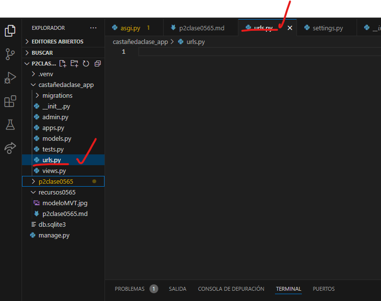
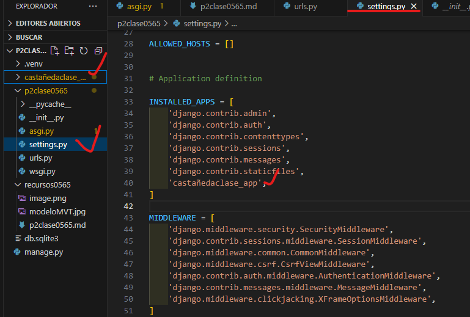
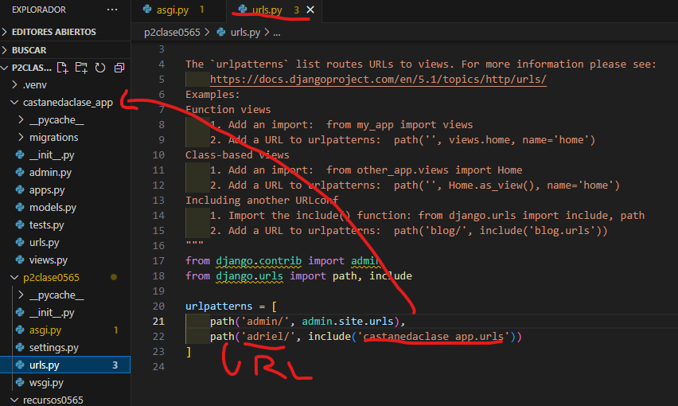
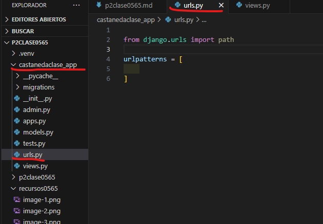
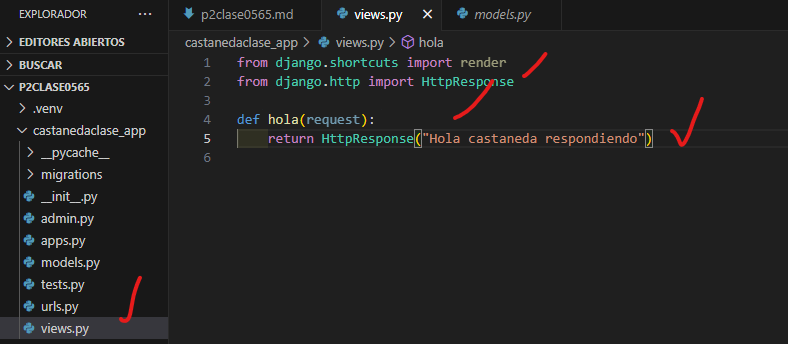
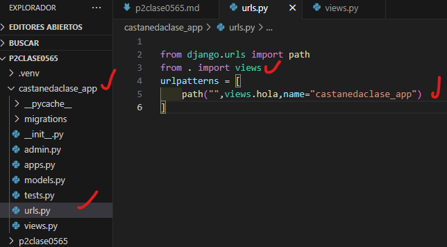

- Crear aplicacion Castañeda_app
- comando --> python manage.py startapp castaedaclase_app
- Creamos el archivo urls.py en castañedaclase_app
- 
- En setting.py de p2clase0565
- 
- En urls.py de p2clase0565
- 
- En urls.py de castanedaclase_app
- 
- en views.py en castanedaclase_app
- 
- en url en castanedaclase
- 